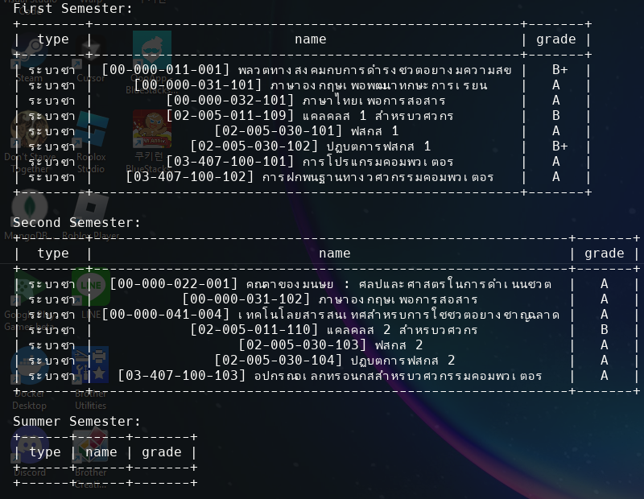
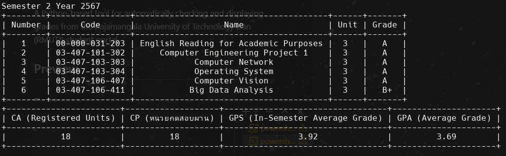

# RMUTI Grade Checker
<div align="center" style="padding:16px">

</div>
A Python-based tool for automatically checking and displaying grades from the Rajamangala University of Technology Isan (RMUTI) student portal.

## Preview
- Get only grade method
<div align="center" style="padding:16px">

</div>
- Get all method
<div align="center" style="padding:16px">

</div>

## Features

- Automated grade checking using Selenium WebDriver
- Two different methods for grade retrieval:
  1. Get only grades (Fastest method)
  2. Get all information (Latest semester details)
- Beautiful table formatting using PrettyTable
- Headless browser operation
- Support for multiple semesters and academic years

## Prerequisites

- Python 3.x
- Microsoft Edge WebDriver
- Required Python packages (listed in requirements.txt)

## Installation

1. Clone this repository:
```bash
git clone https://github.com/yourusername/rmuti-grade-checker.git
cd rmuti-grade-checker
```

2. Install required packages:
```bash
pip install -r requirements.txt
```

3. Make sure you have Microsoft Edge WebDriver installed and in your system PATH.

## Usage

1. Open `main.py` and update the following variables with your credentials:
```python
username = "your-student-id"
password = "your-password"
```

2. Run the script:
```bash
python main.py
```

3. Choose your preferred method:
   - Method 1: Get only grades (Fastest)
   - Method 2: Get all information (Latest semester)

4. If using Method 1, enter the academic year you want to check.

## Output

The script will display your grades in a formatted table showing:
- Course type
- Course code
- Grade
- Additional statistics (when using Method 2):
  - CA (Registered Units)
  - CP (หน่วยกิตสอบผ่าน)
  - GPS (In-Semester Average Grade)
  - GPA (Average Grade)

## Security Note

- Never commit your actual credentials to the repository
- Consider using environment variables or a configuration file for sensitive information

## Dependencies

- selenium: For web automation
- PrettyTable: For formatted table output

## License

This project is licensed under the MIT License - see the LICENSE file for details.

## Contributing

Contributions are welcome! Please feel free to submit a Pull Request.